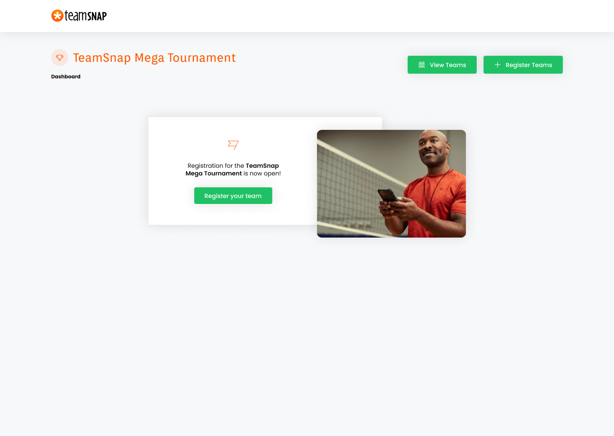

# TeamSnap: Technical Challenge

This project was developed as a part of the hiring process for a Full-Stack Software Engineer position at [TeamSnap](https://www.teamsnap.com/). 🫶🏻

The application itself consists in a simple dashboard of the TeamSnap Mega Tournament! You can find more details about the event at the end of this file.

Some important features:

- List teams: users can see a complete list with all the subscribed teams and its correspondents captains `(/teams)`.
- Register new teams: users can add new teams by naming them and setting a captain `(/join)`.

Last but not least, the app has a brand new interface that I have designed on Figma. 🚀

Sounds awesome, right?

Take a look at the screenshot below or open the design file [here](https://www.figma.com/file/qUXC7dJoAC2Cl2mZK31oul/TeamSnap-Challenge).



Next, we'll check how to run the project and see the magic happens! 🤩

## Dependencies (Tech Stack)

This project was built in **React** and a few more loving technologies.

So, as you already know, we'll need the **Node.js** platform and for this specific case **yarn** package manager as well. But no worries, these guys will run inside a **Docker** container.

The backend layer was built in **Ruby on Rails** and I created a few scripts in **Shell**, just in order to solve some architectural issues and log the discovery process.

## How to run the project

Okay, guys, this is the fun part. 😌

Open your terminal, go to the folder you're used to storing your web projects. Then, run the following:

```sh
git clone git@github.com:luiz-from-delta/team-snap-mega-tournament.git
cd team-snap-mega-tournament
```

Make sure you have started your Docker and run the following:

```sh
docker-compose build

docker-compose run frontend yarn
docker-compose run backend bundle exec rake db:create

docker-compose up -d

open http://localhost:80

cd ..
```

Simple as that!

You'll see the project interface on your browser by clicking on the frontend container link shown on Yaichi homepage.

Have fun! 🎉

## Next Steps

- Finish the card component shown on the Home page.
- Finish the style theme.
- Paginate the results on View Teams page.
- Implement feedbacks for the users, like a toast (this is very important from the UX perspective!).
- Implement the Reset Form button.
- Implements tests to make sure we've been made a good job. Sorry, but unfortunately I had no time for that yet, so I prioritized finishing the features.

I've designed these last two points, so we can think in it in the future. :D

# TeamSnap Mega Tournament!

The TeamSnap mega tournament is the biggest tournament of the year. The TeamSnap Mega Tournment repo (this repo) runs the entire tournament. Or, it would if it fully worked!

We need your help to save the tournament!

How to help:

- Backend [go here!](https://github.com/teamsnap/teamsnap-mega-tournament/blob/main/backend/README.md)
- Frontend [go here!](https://github.com/teamsnap/teamsnap-mega-tournament/blob/main/frontend/README.md)
- Full Stack: Do both (but you'll probably want to start with the backend)
